# ما هو المشروع؟
المشروع عبارة عن تطبيق لمساعدة الطلاب وزيادة انتاجيتهم

# مميزات المشروع:
1. اضافة مهام ومتابعتها
2. اضافة عادات ومتابعتها
3. التطبيق يقدم مصادر تعليمية متنوعة

# كيف يعمل التطبيق؟
فكرة التطبيق تعتمد على تطبيق مفهوم SPA (Single Page Application)

# Screenshots:
1. في الوضع الطبيعي:
* 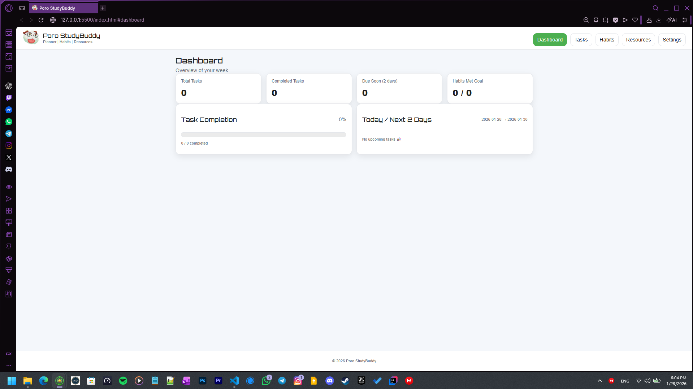
* 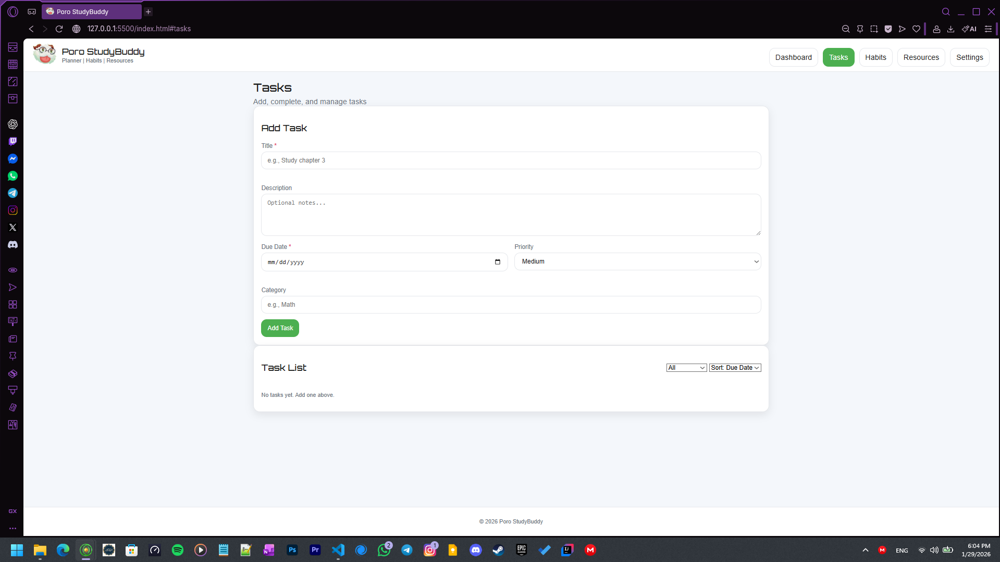
* 
* 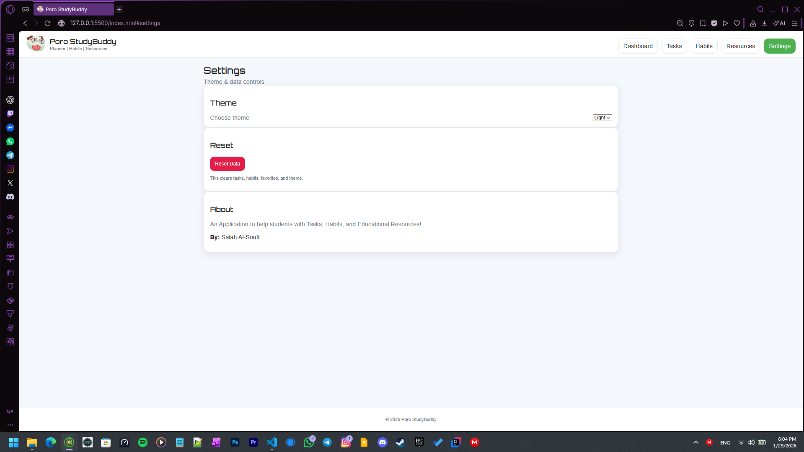
* 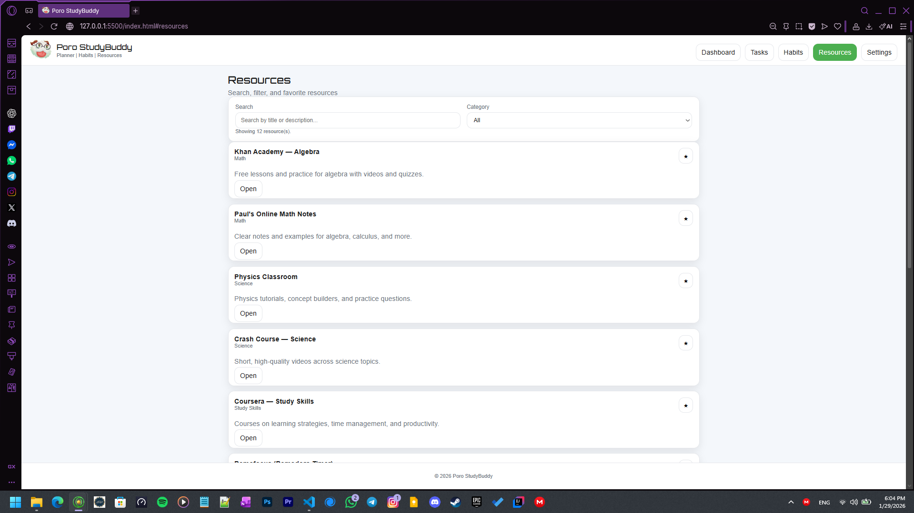

2. في الوضع المظلم:
* 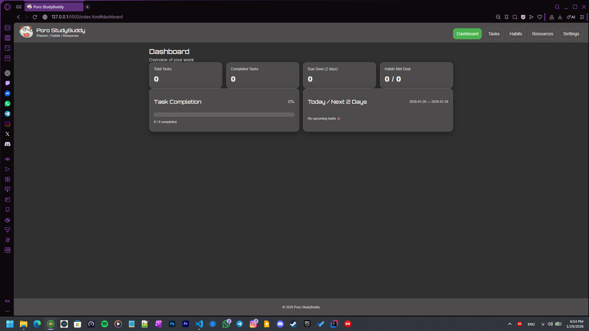
* 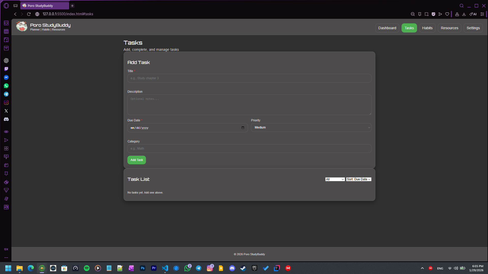
* 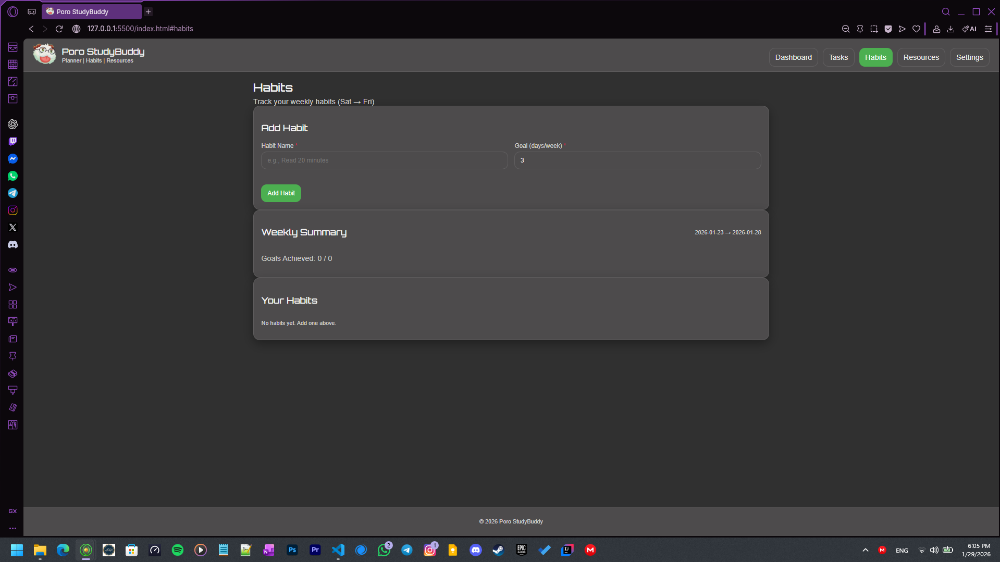
* 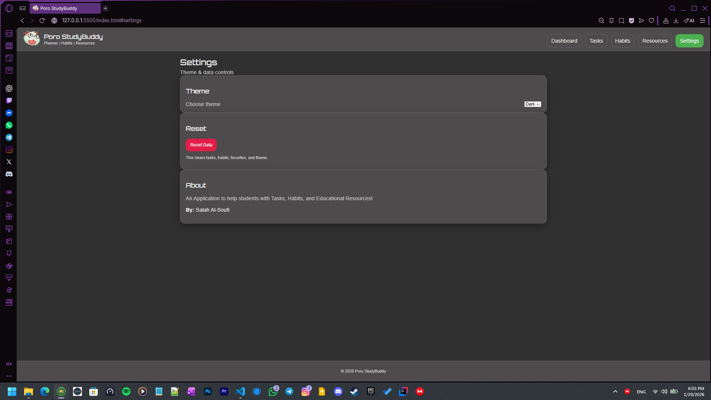
* 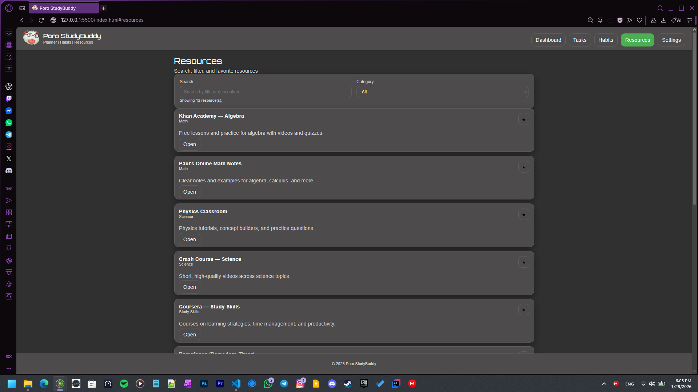

3. في وضع الموبايل:
* 
* 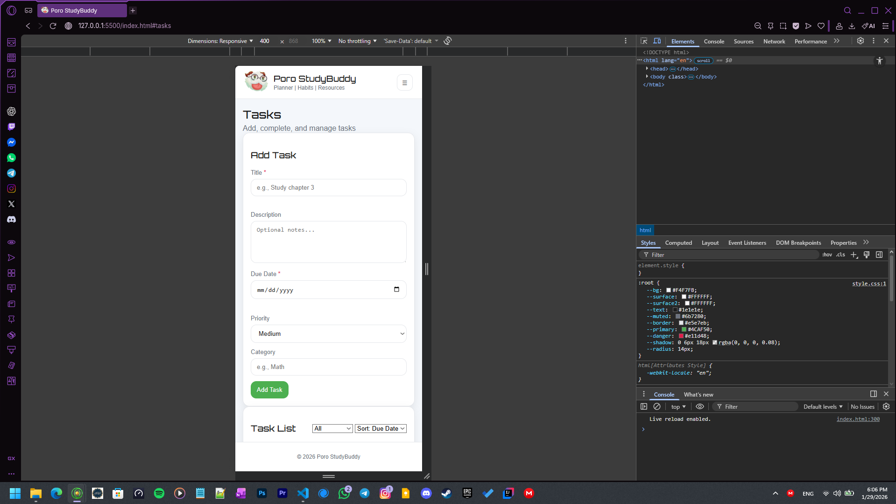
* 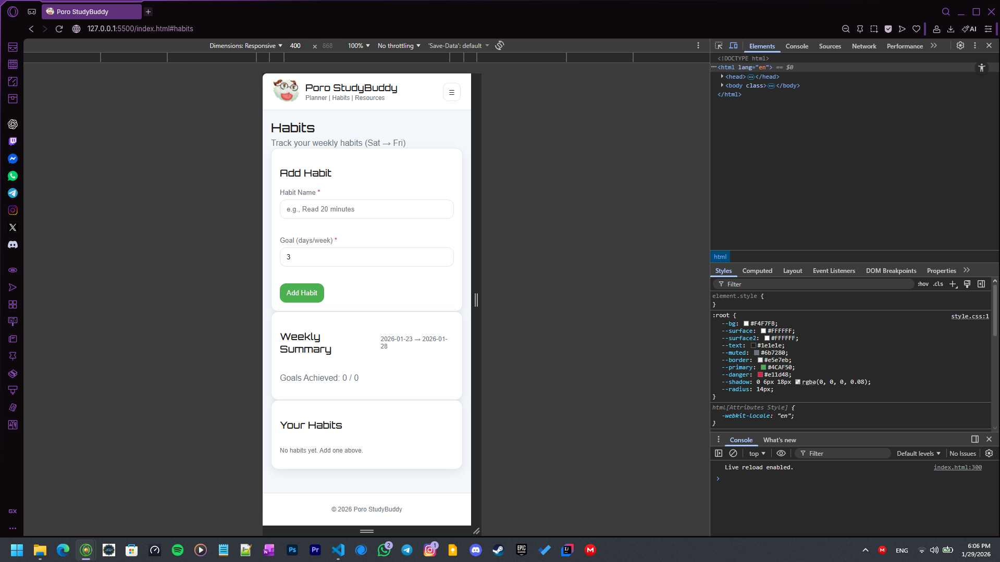
* 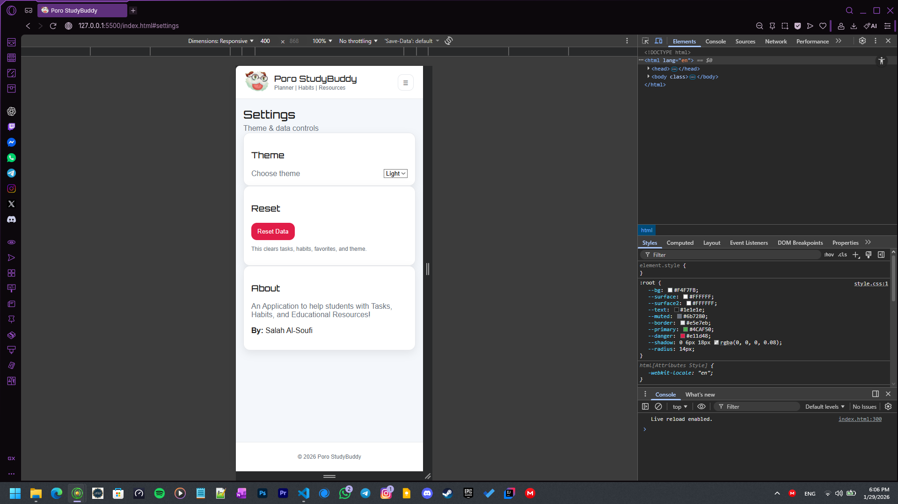
* 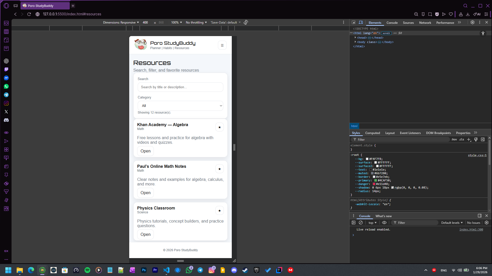

